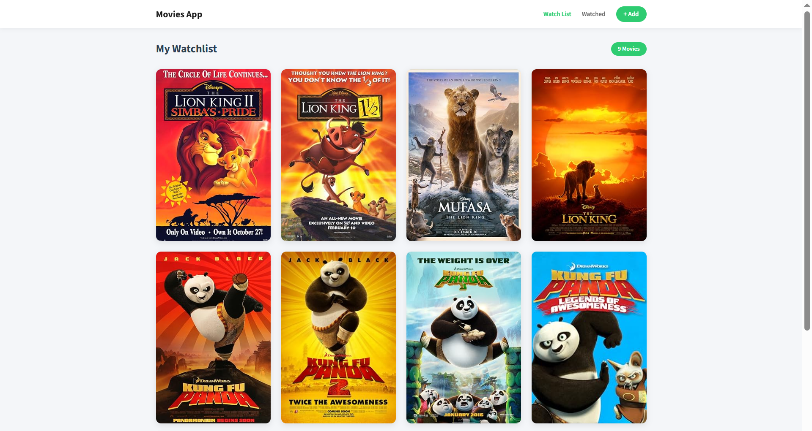

# Movies Watchlist App

A modern and responsive Movies App built with **React** and **Vanilla CSS** that interacts with the **OMDb API** to let users search for movies, manage a custom watchlist, and track their watched films.


## 📸 Preview



## Features
* **Live API Search:** Dynamically fetches real-time movie data (titles, posters, and years) from OMDb API.
* **Dual Lists:** Smoothly manage custom folders for your **Watchlist** and **Watched** movies.
* **State Persistence:** Integrated with `localStorage` to ensure user movie lists are saved across browser refreshes.
* **Interactive UI:** Features a sleek dark overlay with action buttons (Mark as Watched 👁 / Remove ✕) upon hovering over movie posters.
* **Robust UX:** Implements reactive loading spinners and precise network/not-found error handler boxes.


## 🛠️ Tech Stack
* React (Vite)
* React Router DOM (v6 Multi-page Navigation)
* React Context API (Global State Management)
* Vanilla CSS (Flexbox & Grid Systems)
* OMDb API (Data Source)


## 📂 Project Structure

```text
MOVIES APP
├── 📁 node_modules
├── 📁 public
│   └── 📄 Preview.png         # Project preview image for GitHub
├── 📁 src
│   ├── 📁 components
│   │   ├── 📄 Header.jsx      # Navigation bar with lists and Add button
│   │   └── 📄 MovieCard.jsx   # Dynamic movie item card with hover overlay actions
│   ├── 📁 context
│   │   └── 📄 GlobalState.jsx # Context Provider managing global states and functions
│   ├── 📁 pages
│   │   ├── 📄 Add.jsx         # Movie search page connected to the live API
│   │   ├── 📄 Watched.jsx     # Screen displaying all watched movies
│   │   └── 📄 Watchlist.jsx   # Screen displaying saved watchlist movies
│   ├── 📄 App.css             # Main styling using modern Vanilla CSS
│   ├── 📄 App.jsx             # Root component handling routes and context wrapping
│   ├── 📄 index.css           # Base styles and reset properties
│   └── 📄 main.jsx            # Application entry point
├── 📄 .gitignore              # Ignored files to protect node_modules and keys
├── 📄 package.json            # Project dependencies and metadata
└── 📄 vite.config.js          # Vite build environment configuration
```


## 🚀 Live Demo & Preview

🔗 https://movies-watchlist-app-pi.vercel.app

